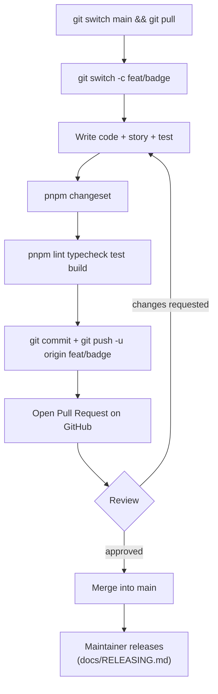

# Contributing

How to set up the repo, make a change, and get it merged. For how the pieces fit together, see
[docs/ARCHITECTURE.md](docs/ARCHITECTURE.md). For publishing to npm, see
[docs/RELEASING.md](docs/RELEASING.md).

## One-time setup

Requirements: **Node 22+** (`.nvmrc` pins 24) and **pnpm 11**.

```sh
git clone git@github.com:bhuvnesh179/design-system.git
cd design-system
nvm use                 # optional, picks Node from .nvmrc
corepack enable         # makes the pinned pnpm version available
pnpm install
pnpm --filter @100xbansal/storybook exec playwright install chromium   # for story tests
```

Set your git identity **for this repo** (use the email on your GitHub account, or commits
won't be linked to you):

```sh
git config user.name  "your-github-username"
git config user.email "you@example.com"
```

## Everyday commands

Run from the repo root:

| Command          | What it does                                         |
| ---------------- | ---------------------------------------------------- |
| `pnpm storybook` | Storybook at http://localhost:6006 with hot reload   |
| `pnpm dev`       | Storybook + `tsup --watch` for all packages          |
| `pnpm build`     | Build everything (cached by Turbo)                   |
| `pnpm test`      | Unit tests + story tests                             |
| `pnpm lint`      | ESLint everywhere                                    |
| `pnpm typecheck` | TypeScript everywhere                                |
| `pnpm format`    | Prettier write                                       |
| `pnpm changeset` | Describe your change for the changelog (interactive) |

Run one package's task with a filter, e.g. `pnpm --filter @100xbansal/ui test` or
`pnpm turbo run test --filter=@100xbansal/ui`.

## The workflow



### 1. Start from an up-to-date `main`

```sh
git switch main
git pull
pnpm install            # in case dependencies changed
git switch -c feat/badge
```

Branch names: `feat/…` new features, `fix/…` bug fixes, `docs/…`, `chore/…`.

If you don't have write access to the repo, **fork** it on GitHub first, clone your fork, and
open the pull request from your fork.

### 2. Make the change

**Adding a component:** run `/new-component Badge` in Claude Code. It asks about the API, creates
all five files from the templates, exports the component, runs the checks, and adds a changeset.
To do it by hand, copy the `Button` folder's structure and follow the conventions in
[ARCHITECTURE.md → Component anatomy](docs/ARCHITECTURE.md#component-anatomy). Don't forget
to add `export * from './components/Badge';` in `packages/ui/src/index.ts`.

**Adding or changing tokens:** edit `packages/tokens/src/index.ts`. New colors go into
`SemanticColors` **and** both `lightColors` and `darkColors`.

Check your work in Storybook (`pnpm storybook`), in both light and dark mode (toolbar → Theme).

### 3. Add a changeset

Any change to a **published** package (`@100xbansal/ui`, `@100xbansal/tokens`) that users would
notice needs a changeset:

```sh
pnpm changeset
```

Pick the package(s) and the bump, then write one line for the changelog. This creates a file like
`.changeset/brave-dogs-smile.md`, which you commit with your code:

```md
---
'@100xbansal/ui': minor
---

Add `Badge` component.
```

| Bump    | When                                                  | Example                                   |
| ------- | ----------------------------------------------------- | ----------------------------------------- |
| `patch` | Bug fix, style fix, no API change                     | Fix Button focus ring in dark mode        |
| `minor` | New component, prop, variant, token                   | Add `Badge`; add `size` prop to TextField |
| `major` | Removing/renaming exports or props, changing defaults | Rename `variant="ghost"` to `"subtle"`    |

No changeset needed for changes that only touch stories, tests, docs outside the packages, or
private packages. You **don't** change version numbers in `package.json` yourself; the release
step does that.

### 4. Check before pushing

```sh
pnpm format
pnpm lint && pnpm typecheck && pnpm test && pnpm build
```

### 5. Commit and push

Commit messages follow [Conventional Commits](https://www.conventionalcommits.org):
`feat(ui): add Badge component`, `fix(tokens): raise danger contrast`, `docs: …`, `chore: …`.

```sh
git add packages/ui/src/components/Badge packages/ui/src/index.ts .changeset/
git commit -m "feat(ui): add Badge component"
git push -u origin feat/badge
```

### 6. Open a pull request

On GitHub, open a PR from your branch into `main`. In the description, say what changed and why,
and add a screenshot from Storybook for visual changes. A reviewer checks the code, the story, and
the changeset. Push more commits to the same branch to address feedback. Once approved, it's
merged into `main`.

Merging **doesn't** publish anything. Changesets pile up in `.changeset/` until a maintainer
cuts a release, which bundles all of them into one version bump and changelog.

## Testing your change in another app before release

```sh
pnpm --filter @100xbansal/ui build
cd packages/ui && pnpm pack          # creates 100xbansal-ui-<version>.tgz
# in the other app:
npm install /path/to/design-system/packages/ui/100xbansal-ui-<version>.tgz
```

`pnpm pack` produces exactly what npm would publish, so this is the most realistic test.
Delete the `.tgz` afterwards; don't commit it.

## Using Claude Code in this repo

Two project skills live in `.claude/skills/`:

| Skill                   | Use it for                                                           |
| ----------------------- | -------------------------------------------------------------------- |
| `/new-component <Name>` | Scaffold a component with styles, story, test, export, and changeset |
| `/release`              | Write changesets, bump versions, prepare a release                   |

## Troubleshooting

| Problem                                              | Fix                                                                                                |
| ---------------------------------------------------- | -------------------------------------------------------------------------------------------------- |
| Story tests fail with `browserType.launch … SIGSEGV` | Reinstall Chromium: `pnpm --filter @100xbansal/storybook exec playwright install --force chromium` |
| `Ignored build scripts: esbuild`                     | esbuild must be `true` under `allowBuilds` in `pnpm-workspace.yaml`                                |
| Types from `@100xbansal/tokens` not found in `ui`    | Run `pnpm install`; the `@100xbansal/source` condition needs the workspace link                    |
| Build output seems stale                             | `rm -rf packages/*/dist .turbo && pnpm build`                                                      |
