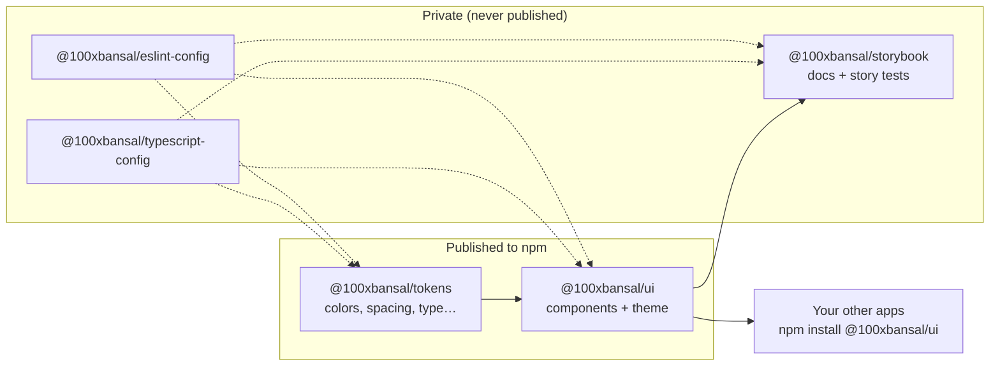
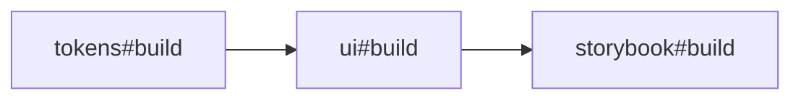

# Architecture

How the repo is put together: what each package does, how they depend on each other, and what
happens when you run `dev`, `build`, `test`, and `release`.

## Big picture



It's a **pnpm workspace** orchestrated by **Turborepo**. Each folder in `packages/*` and `apps/*`
is its own package with its own `package.json`. Workspace packages depend on each other with
`"workspace:*"`, which pnpm links locally and replaces with the real version number when publishing.

## Folder layout

```text
design-system/
├── apps/
│   └── storybook/                 @100xbansal/storybook (private)
│       ├── .storybook/main.ts     finds stories in packages/ui, addons, Vite config
│       ├── .storybook/preview.tsx wraps every story in DesignSystemProvider + theme toolbar
│       ├── src/Introduction.mdx   landing docs page
│       └── vitest.config.ts       runs every story as a browser test
├── packages/
│   ├── tokens/                    @100xbansal/tokens (published)
│   │   └── src/index.ts           palette, semantic light/dark colors, scales
│   ├── ui/                        @100xbansal/ui (published)
│   │   ├── src/components/<Name>/ component, styles, stories, tests, index
│   │   ├── src/provider/          DesignSystemProvider + useColorMode
│   │   ├── src/theme/             Theme type, light/dark themes, GlobalStyle
│   │   ├── src/test/              Vitest setup + renderWithTheme helper
│   │   ├── src/index.ts           public API: everything exported from here
│   │   ├── tsup.config.ts         library build
│   │   └── vitest.config.ts       unit tests (jsdom)
│   ├── typescript-config/         shared tsconfig presets (private)
│   └── eslint-config/             shared ESLint flat config (private)
├── .changeset/                    pending changelog entries + Changesets config
├── .claude/skills/                Claude Code skills: /new-component, /release
├── docs/                          you are here
├── turbo.json                     task pipeline
└── pnpm-workspace.yaml            workspace + pnpm install policy
```

## The packages

### `@100xbansal/tokens`

Plain TypeScript objects, marked `as const` so every value is typed: `palette`, `space`,
`radii`, `fonts`, `fontSizes`, `fontWeights`, `lineHeights`, `shadows`, `breakpoints`, `zIndices`,
`durations`, and the **semantic colors** `lightColors` / `darkColors` (e.g. `bg`, `fg`, `accent`,
`danger`, `focusRing`). No React and no styled-components, so any project can use it.

Components never use `palette` directly. They use semantic colors, which is what makes dark mode work.

### `@100xbansal/ui`

- **Theme** (`src/theme/`): `lightTheme` and `darkTheme` are `tokens scales + colorMode + colors`.
  `src/theme/styled.ts` augments styled-components' `DefaultTheme`, so `theme.colors.accent` is
  typed everywhere, in this repo and in consumer apps.
- **Provider** (`src/provider/`): `DesignSystemProvider` renders the styled-components
  `ThemeProvider`, injects `GlobalStyle`, and exposes color mode through React 19 context
  (`<Context value>` + `use()`). `useColorMode()` reads/sets it.
- **Components** (`src/components/`): one folder per component. See the conventions below.

### `@100xbansal/storybook`

Storybook 10 (React + Vite). It doesn't hold any stories itself. `main.ts` pulls them from
`packages/ui/src/**/*.stories.tsx`, so a component's story lives next to its code. Addons:

- **addon-docs**: auto-generated docs page for every component (`tags: ['autodocs']`).
- **addon-a11y**: runs axe on every story. `a11y.test: 'error'` makes violations fail the tests.
- **addon-vitest**: turns every story (and its `play` function) into a test that runs in
  headless Chromium.

## Component anatomy

```text
packages/ui/src/components/Button/
├── Button.tsx          logic + JSX, no CSS
├── Button.styles.ts    styled-components, variant/size maps
├── Button.stories.tsx  Storybook stories + play-function tests
├── Button.test.tsx     Vitest + Testing Library unit tests
└── index.ts            re-exports the component and its public types
```

Conventions every component follows (the `/new-component` skill enforces them):

| Rule                                                                        | Why                                                |
| --------------------------------------------------------------------------- | -------------------------------------------------- |
| `ref` is a normal prop (`ComponentPropsWithRef<'button'>`), no `forwardRef` | React 19                                           |
| Style-only props are transient: `$variant`, `$size`                         | Keeps them off the DOM                             |
| Only theme values in CSS (`theme.colors.*`, `theme.space[n]`), no hex codes | Dark mode + consistency                            |
| Spread `...props` onto the root element                                     | Consumers can pass `className`, `aria-*`, `data-*` |
| `&:focus-visible` outline with `theme.colors.focusRing`                     | Keyboard accessibility                             |
| Exported from `packages/ui/src/index.ts`                                    | Anything not exported there isn't public           |

React 19 features in use: ref as a prop, `use(Context)`, `<Context value>` as provider, `useId`,
`useFormStatus` (Button shows a spinner while its `<form action>` is pending), and
`useActionState` (TextField story).

## How source resolution works (no build needed during dev)

Each published package's `exports` has a custom condition first:

```json
".": {
  "@100xbansal/source": "./src/index.ts",
  "import":  { "types": "./dist/index.d.ts",  "default": "./dist/index.js" },
  "require": { "types": "./dist/index.d.cts", "default": "./dist/index.cjs" }
}
```

Inside the repo, TypeScript (`customConditions` in `typescript-config/base.json`), Vitest, and
Storybook's Vite config all enable `@100xbansal/source`, so `import … from '@100xbansal/tokens'`
resolves to **TypeScript source**. Edits show up instantly and typecheck doesn't need a build first.

When publishing, `publishConfig.exports` in each `package.json` replaces `exports` without that
condition, so npm users only ever see `dist/`.

## Build pipeline

`tsup` (esbuild) builds each published package into:

| File                                  | For                  |
| ------------------------------------- | -------------------- |
| `dist/index.js`                       | ESM (`import`)       |
| `dist/index.cjs`                      | CommonJS (`require`) |
| `dist/index.d.ts`, `dist/index.d.cts` | Types                |
| `*.map`                               | Source maps          |

- `react`, `react-dom`, and `styled-components` are **peer dependencies**: they're not bundled,
  the consumer app provides them.
- The ui bundle starts with `"use client"` (tsup `banner`). styled-components needs React context,
  so this marks the whole library as Client Components and lets Next.js App Router Server
  Components import from it.
- `sideEffects: false` lets consumer bundlers tree-shake unused components.

## Turborepo task graph



`turbo.json`:

| Task                        | Behavior                                                                                             |
| --------------------------- | ---------------------------------------------------------------------------------------------------- |
| `build`                     | `dependsOn: ["^build"]`: builds dependencies first. Cached; outputs `dist/**`, `storybook-static/**` |
| `dev`                       | Not cached, persistent: `tsup --watch` for packages + `storybook dev`                                |
| `lint`, `typecheck`, `test` | Independent per package, cached                                                                      |

Turbo caches results in `.turbo/`. If inputs haven't changed, you'll see `cache hit` and
`FULL TURBO`, and the task is skipped.

## Testing layers

| Layer                | Where                           | Runs in                                  | Command                                    |
| -------------------- | ------------------------------- | ---------------------------------------- | ------------------------------------------ |
| Unit tests           | `packages/ui/src/**/*.test.tsx` | Vitest + jsdom                           | `pnpm --filter @100xbansal/ui test`        |
| Story tests (+ a11y) | every `*.stories.tsx`           | Vitest browser mode, Playwright Chromium | `pnpm --filter @100xbansal/storybook test` |
| Types                | every package                   | `tsc --noEmit`                           | `pnpm typecheck`                           |
| Lint                 | every package                   | ESLint 10 flat config                    | `pnpm lint`                                |

## Versions and why

| Tool              | Version | Note                                                                                                 |
| ----------------- | ------- | ---------------------------------------------------------------------------------------------------- |
| React             | 19.3    |                                                                                                      |
| TypeScript        | 6.0     | Not 7.x: typescript-eslint supports `<6.1`                                                           |
| Vitest            | 4.1     | Not 5.x: `@storybook/addon-vitest` supports `^3 \|\| ^4`                                             |
| Storybook         | 10.6    |                                                                                                      |
| Vite              | 8       |                                                                                                      |
| styled-components | 6.5     |                                                                                                      |
| tsup              | 8.5     | `dts.compilerOptions.ignoreDeprecations: '6.0'` works around tsup injecting the deprecated `baseUrl` |
| ESLint            | 10      | Flat config                                                                                          |
| Turbo             | 2.11    |                                                                                                      |
| pnpm              | 11      | `allowBuilds` in `pnpm-workspace.yaml` lets esbuild run its install script                           |
| Changesets        | 3       |                                                                                                      |
