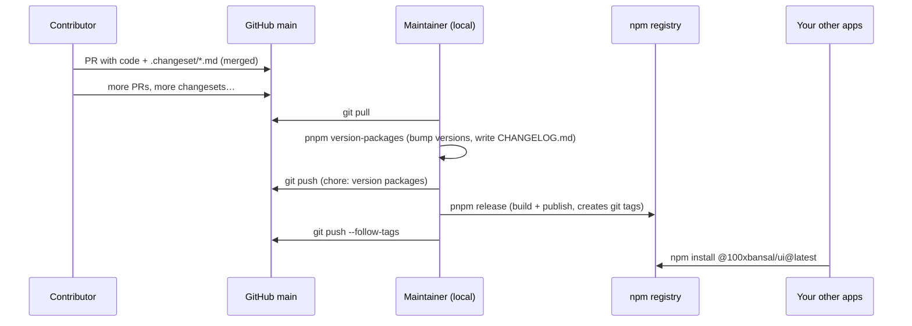

# Releasing

How code gets from this repo to npm, and from npm into your other projects.

## The two places code lives

|             | GitHub (`bhuvnesh179/design-system`)                   | npm (`@100xbansal/ui`, `@100xbansal/tokens`)                         |
| ----------- | ------------------------------------------------------ | -------------------------------------------------------------------- |
| What        | The **source**: all packages, Storybook, docs, history | The **built package**: just `dist/`, README, LICENSE, `package.json` |
| Updated by  | `git push`                                             | `pnpm release`                                                       |
| Who uses it | People working **on** the design system                | Apps **using** the design system                                     |

They're independent: pushing to GitHub doesn't publish to npm, and publishing doesn't push to
GitHub. The release process below keeps them in sync, with the version numbers, changelogs,
and git tags matching.

## End-to-end flow



## Release checklist

Run this when `main` has changesets you want to ship. Needs npm publish rights on the
`@100xbansal` scope.

### 1. Update and check what's pending

```sh
git switch main
git pull
pnpm install
pnpm changeset status --verbose     # which packages bump, and to what
```

Nothing listed means there's nothing to release.

### 2. Bump versions and write changelogs

```sh
pnpm version-packages               # consumes .changeset/*.md
pnpm install                        # refresh the lockfile
pnpm lint && pnpm typecheck && pnpm test && pnpm build
```

This deletes the consumed changeset files, bumps `version` in each affected `package.json`, bumps
internal dependents (if `tokens` bumps, `ui` gets a patch to depend on the new `tokens`), and
prepends entries to each package's `CHANGELOG.md`. Review the diff.

### 3. Commit and push the version bump

```sh
git add -A
git commit -m "chore: version packages"
git push
```

### 4. Publish to npm (in a real terminal)

```sh
npm whoami                          # must print your npm username; otherwise `npm login`
pnpm release
```

`pnpm release` runs `turbo run build` for all packages, then `changeset publish`, which:

1. Checks the registry and publishes each package whose current version **isn't on npm yet**
   (already-published ones are skipped, so a rerun after a partial failure is safe).
2. Uses `pnpm publish`, which swaps `workspace:*` for real versions and applies
   `publishConfig` (public access, `dist`-only `exports`).
3. Creates a git tag per published package, e.g. `@100xbansal/ui@0.2.0`.

npm requires **two-factor authentication** to publish. Run `pnpm release` in a normal terminal
(not through a tool that runs commands non-interactively, such as Claude Code's `!`) so npm can
open the browser or ask for your authenticator code.

### 5. Push the tags

```sh
git push --follow-tags
```

Tags mark exactly which commit each npm version was built from. Optionally, create a GitHub
Release from a tag and paste the CHANGELOG section into it.

### 6. Verify

```sh
npm view @100xbansal/ui version
npm view @100xbansal/tokens version
```

Or open https://www.npmjs.com/package/@100xbansal/ui.

## Version numbers and what consumers get

We follow [semver](https://semver.org). **While we're below 1.0, minor bumps don't reach
consumers automatically.** npm treats `^0.1.0` as `>=0.1.0 <0.2.0`:

| Consumer has | Release         | Picked up by `npm update`?                        |
| ------------ | --------------- | ------------------------------------------------- |
| `^0.1.0`     | `0.1.1` (patch) | Yes                                               |
| `^0.1.0`     | `0.2.0` (minor) | No, they need `npm install @100xbansal/ui@latest` |
| `^1.2.0`     | `1.3.0` (minor) | Yes                                               |
| `^1.2.0`     | `2.0.0` (major) | No, a breaking change is always opt-in            |

Once the API is stable, release `1.0.0` (a `major` changeset) so that minor releases reach
consumers automatically.

## Using the packages in another project

```sh
npm install @100xbansal/ui styled-components react react-dom
```

```tsx
import { Button, DesignSystemProvider, TextField, useColorMode } from '@100xbansal/ui';

export function App() {
  return (
    <DesignSystemProvider defaultColorMode="light">
      <TextField label="Email" type="email" />
      <Button type="submit">Subscribe</Button>
    </DesignSystemProvider>
  );
}
```

Tokens on their own (no React needed): `npm install @100xbansal/tokens`.

Getting updates later:

```sh
npm outdated @100xbansal/ui              # what's new
npm install @100xbansal/ui@latest        # jump to newest (read CHANGELOG first)
```

**Next.js (App Router):** components already ship with `"use client"`. For server-rendered
styles without a flash of unstyled content, add the styled-components registry
(https://nextjs.org/docs/app/guides/css-in-js#styled-components) and set
`compiler: { styledComponents: true }` in `next.config`.

## Pre-releases (optional)

To let people try changes before a stable release:

```sh
pnpm changeset pre enter beta       # versions become 0.2.0-beta.0, …
pnpm version-packages && pnpm release   # published under the `beta` dist-tag
# consumers: npm install @100xbansal/ui@beta
pnpm changeset pre exit             # before the stable release
```

## Mistakes and fixes

| Situation                                     | What to do                                                                                                 |
| --------------------------------------------- | ---------------------------------------------------------------------------------------------------------- |
| Published a broken version                    | Fix it and release a **patch**. You can't overwrite a version.                                             |
| Need to warn people off a version             | `npm deprecate @100xbansal/ui@0.2.0 "Broken, use 0.2.1"`                                                   |
| Unpublish                                     | Only within 72 hours, and the version number can **never** be reused: `npm unpublish @100xbansal/ui@0.2.0` |
| `ERR_PNPM_OTP_NON_INTERACTIVE`                | You ran publish somewhere non-interactive. Use a real terminal.                                            |
| `E403 … Two-factor authentication … required` | 2FA is off on your npm account. Turn it back on (npm requires it for publishing).                          |
| `E404` / `E403` on first publish              | Check `npm whoami` is `100xbansal`, the owner of the `@100xbansal` scope.                                  |
| One package published, the other failed       | Fix the cause and run `pnpm release` again; published ones are skipped.                                    |

## Not set up yet (possible next steps)

- **CI on pull requests**: a GitHub Actions workflow running `pnpm lint typecheck test build` on
  every PR, so broken code can't merge.
- **Branch protection** on `main`: require a PR and passing CI before merging.
- **Automated publishing**: the Changesets GitHub Action opens a "Version Packages" PR, and merging
  it publishes to npm via npm **trusted publishing** (GitHub is trusted directly, so no tokens or
  2FA prompts). Steps 1–5 above would then happen automatically.
